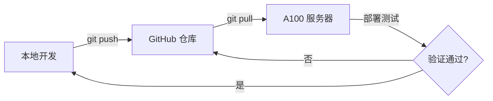

# 开发工作流程规范

## 概述

本项目在三个环境间同步开发：
- **本地开发机** (Windows)
- **A100 服务器** (Linux, SSH: `A100`)
- **GitHub 仓库** (`https://github.com/univesl/writing-assistant.git`)

A100 服务器部署了 `writing-assistant` 的 dev 版本（含文档提取服务等），是本项目的主要运行环境。

## 核心原则

1. **不要直接在服务器上修改代码**。服务器仅用于部署和测试。
2. **所有修改先在本地完成**，测试通过后推送到 GitHub，再从服务器拉取部署。
3. **三地代码保持一致**，避免出现本地能跑、服务器跑不了的情况。

## 标准开发流程



### 步骤详解

1. **同步最新代码**
   ```bash
   # 本地：拉取最新
   git pull github main

   # 服务器：拉取最新
   ssh A100 "cd ~/writing-assistant && git pull github main"
   ```

2. **在本地开发修改**

3. **本地测试**（确保能运行、无报错）

4. **提交并推送**
   ```bash
   git add <files>
   git commit -m "feat: 描述改动内容"
   git push github main
   ```

5. **服务器拉取部署**
   ```bash
   ssh A100 "cd ~/writing-assistant && git pull github main"
   # 如有需要重启服务
   ```

## 紧急修复流程

当服务器上代码需要同步到 GitHub 时：

1. 暂存或提交服务器上的未完成修改
2. 从 GitHub 拉取最新代码
3. 推送服务器本地 commit 到 GitHub

## 分支策略

- **`main`** 分支为唯一稳定分支
- 本地开发直接基于 `main` 进行
- 服务器追踪 `github/main`

## 提交信息规范

```
<type>: <简短描述>

类型: feat / fix / refactor / docs / chore / style / test
示例: feat: 添加文章模板管理功能
      fix: 修复文档导出编码问题
```

## 关于 KnG 知识库服务的注意事项

### 概述

KnG（Knowledge and Generation）是本项目依赖的知识库问答系统，部署在 A100 服务器上。

**重要：KnG 只能部署在 A100 服务器上运行，本地无法调试和测试。**

### 架构位置

```
用户请求 → /api/generate/document → generate_document_async()
  → kng_rag_service.py (本地 KnG 客户端)
    → HTTP 调用 A100 上的 KnG 容器 (kng-rag, 端口 50001)
      → KnG RAG 检索（知识图谱 + 向量检索）
        → 返回检索结果
  → prompt_builder.py (将 RAG 结果 + 用户需求拼成 prompt)
  → LLM 调用 (h3i 平台模型)
```

### 关键文件

| 文件 | 作用 |
|------|------|
| `backend/app/services/kng_rag_service.py` | KnG RAG 客户端，HTTP 调用 A100 上部署的 KnG 服务 |
| `backend/app/services/document_generator.py` | 文档生成服务，协调 kng 检索 + LLM 生成 |
| `backend/app/services/prompt_builder.py` | 统一 prompt 构建，所有写作模式共用 |
| `backend/app/routers/generate.py` | 生成相关的 API 路由 |
| `backend/app/routers/write.py` | 写作相关的 API 路由 |

### 开发与测试约定

1. **所有 kng 调用只能通过服务器测试**，本地无法模拟 kng 响应。

2. **前端的 kng 调用链路**（修改前端时特别注意）：
   - 快速写作 → 调用 `/api/generate/document`（后端触发 kng 检索）
   - 参考写作 → 调用 `/api/generate/reference-write`（后端可选触发 kng 检索）
   - 回函生成 → 调用 `/api/generate/reply`（后端可选触发 kng 检索）

3. **前端不直接调用 kng**，所有 kng 调用都在后端封装。

4. **修改前端时不要改变以下 kng 相关接口的请求格式**：
   - `POST /api/generate/document` — `{topic, requirements, model_name, use_knowledge_base, top_k}`
   - `POST /api/generate/reference-write` — `{reference_content, reference_filename, generate_type, topic, requirements, use_knowledge_base, top_k}`
   - `POST /api/generate/reply` — `{topic, requirements, original_content, extracted_fields, use_knowledge_base, top_k}`
   - `POST /api/write/quick` — `{session_id, mode, style, user_requirements, rag_content, rag_references, ...}`

5. **prompt_builder.py** 是 prompt 构建核心，所有写作模式的 prompt 都在这里统一构建。修改 prompt 逻辑时确保不会破坏现有的 `rag_content` 注入逻辑。

6. **`kng_rag_service.py` 中的 `KNG_BASE_URL`** 环境变量指向 A100 上的 KnG 容器地址 (`http://127.0.0.1:50001`)，服务器上已配置好，本地不需要配置。

### 常见风险和防范

| 风险 | 防范措施 |
|------|----------|
| 本地改了前端接口格式，服务器上 kng 调用不匹配 | 所有 kng 相关接口的请求参数保持不变，增加字段时可设默认值 |
| 修改 prompt_builder 导致 rag_content 不再注入 | 修改后对比测试：确保 `rag_content` 字段仍出现在 system/user prompt 中 |
| 前端重构时删除了 kng 相关调用的入口 | 保留 `generateApi.generateDocument()` 和所有 `use_knowledge_base` 参数 |
| 本地开发时 kng 不可用导致测试困难 | 后端 `document_generator.py` 有 `service.is_ready()` 检查，kng 不可用时自动跳过检索 |

## 项目配置文件

A100 服务器上 kng 容器的相关配置：
- **容器名**: `kng-rag`
- **API 地址**: `http://127.0.0.1:50001`
- **API 路径**: `/api/v1/chats_openai/default/chat/completions` (兼容 OpenAI 格式)
- **数据目录**: `/home/liubin/kng-dev/kng-dev/`

## 关于本文件

本文件应随项目推进不断完善，记录开发实践中遇到的问题和解决方案。