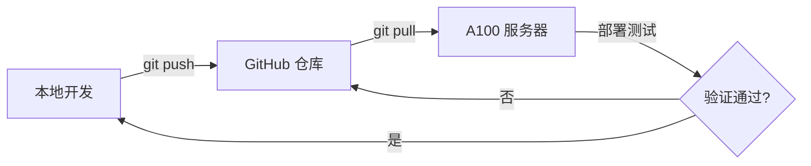

# 开发工作流程规范

## 概述

本项目在三个环境间同步开发：
- **本地开发机** (Windows)
- **A100 服务器** (Linux, SSH: `A100`)
- **GitHub 仓库** (`https://github.com/univesl/writing-assistant.git`)

A100 服务器部署了 `writing-assistant` 的 dev 版本（含文档提取服务等），是本项目的主要运行环境。

## 核心原则

1. **不要直接在服务器上修改代码**。服务器仅用于部署和测试。
2. **所有修改先在本地完成**，测试通过后推送到 GitHub，再从服务器拉取部署。
3. **三地代码保持一致**，避免出现本地能跑、服务器跑不了的情况。
4. **本文件（DEV_WORKFLOW.md）仅作为本地开发参考，不提交到 GitHub 仓库。**

## 标准开发流程



### 步骤详解

1. **同步最新代码**
   ```bash
   # 本地：拉取最新
   git pull github main

   # 服务器：拉取最新
   ssh A100 "cd ~/writing-assistant && git pull github main"
   ```

2. **在本地开发修改**

3. **本地测试**（确保能运行、无报错）

4. **提交并推送**
   ```bash
   git add <files>
   git commit -m "feat: 描述改动内容"
   git push github main
   ```

5. **服务器拉取部署**
   ```bash
   ssh A100 "cd ~/writing-assistant && git pull github main"
   # 如有需要重启服务
   ```

## 紧急修复流程

当服务器上代码需要同步到 GitHub 时：

1. 暂存或提交服务器上的未完成修改
2. 从 GitHub 拉取最新代码
3. 推送服务器本地 commit 到 GitHub

## 分支策略

- **`main`** — 稳定分支，生产环境代码。只接受从 dev 合并过来的、经过测试的代码。
- **`dev`** — 开发分支，日常开发在此进行。修改后推送到 `github/dev`，在服务器上部署测试。
- 服务器上 main 和 dev 都追踪对应的远程分支。

### 开发流程

```
本地 dev 开发 → git push github dev → 服务器拉取 dev → 测试 → 合并到 main → 服务器拉取 main
```

### 步骤详解

1. **切换到 dev 分支**
   ```bash
   git checkout dev
   ```

2. **从 GitHub 拉取最新 dev**
   ```bash
   git pull github dev
   ```

3. **在本地开发修改**

4. **本地测试**（确保能运行、无报错）

5. **提交并推送到 dev**
   ```bash
   git add <files>
   git commit -m "feat: 描述改动内容"
   git push github dev
   ```

6. **服务器拉取 dev 部署测试**
   ```bash
   ssh A100 "cd ~/writing-assistant && git pull github dev"
   ```

7. **测试通过后合并到 main**
   ```bash
   git checkout main
   git pull github main
   git merge dev
   git push github main
   ```

8. **服务器拉取 main**
   ```bash
   ssh A100 "cd ~/writing-assistant && git pull github main"
   ```

### 服务器分支切换

服务器目前 dev 分支追踪 `github/dev`。如果需要让服务器跑 main 版本：
```bash
ssh A100 "cd ~/writing-assistant && git checkout main && git pull github main"
```

## 紧急修复流程

如果需要在 main 上直接修复：
1. 在 dev 分支修复并推送
2. 测试通过后合并到 main
3. 服务器拉取 main

## 提交信息规范

```
<type>: <简短描述>

类型: feat / fix / refactor / docs / chore / style / test
示例: feat: 添加文章模板管理功能
      fix: 修复文档导出编码问题
```

## 关于 KnG 知识库服务的注意事项

### 概述

KnG（Knowledge and Generation）是本项目依赖的知识库问答系统，部署在 A100 服务器上。

**重要：KnG 只能部署在 A100 服务器上运行，本地无法调试和测试。**

### 架构位置

```
用户请求 → /api/generate/document → generate_document_async()
  → kng_rag_service.py (本地 KnG 客户端)
    → HTTP 调用 A100 上的 KnG 容器 (kng-rag, 端口 50001)
      → KnG RAG 检索（知识图谱 + 向量检索）
        → 返回检索结果
  → prompt_builder.py (将 RAG 结果 + 用户需求拼成 prompt)
  → LLM 调用 (h3i 平台模型)
```

### 关键文件

| 文件 | 作用 |
|------|------|
| `backend/app/services/kng_rag_service.py` | KnG RAG 客户端，HTTP 调用 A100 上部署的 KnG 服务 |
| `backend/app/services/document_generator.py` | 文档生成服务，协调 kng 检索 + LLM 生成 |
| `backend/app/services/prompt_builder.py` | 统一 prompt 构建，所有写作模式共用 |
| `backend/app/routers/generate.py` | 生成相关的 API 路由 |
| `backend/app/routers/write.py` | 写作相关的 API 路由 |

### 开发与测试约定

1. **所有 kng 调用只能通过服务器测试**，本地无法模拟 kng 响应。

2. **前端的 kng 调用链路**（修改前端时特别注意）：
   - 快速写作 → 调用 `/api/generate/document`（后端触发 kng 检索）
   - 参考写作 → 调用 `/api/generate/reference-write`（后端可选触发 kng 检索）
   - 回函生成 → 调用 `/api/generate/reply`（后端可选触发 kng 检索）

3. **前端不直接调用 kng**，所有 kng 调用都在后端封装。

4. **修改前端时不要改变以下 kng 相关接口的请求格式**：
   - `POST /api/generate/document` — `{topic, requirements, model_name, use_knowledge_base, top_k}`
   - `POST /api/generate/reference-write` — `{reference_content, reference_filename, generate_type, topic, requirements, use_knowledge_base, top_k}`
   - `POST /api/generate/reply` — `{topic, requirements, original_content, extracted_fields, use_knowledge_base, top_k}`
   - `POST /api/write/quick` — `{session_id, mode, style, user_requirements, rag_content, rag_references, ...}`

5. **prompt_builder.py** 是 prompt 构建核心，所有写作模式的 prompt 都在这里统一构建。修改 prompt 逻辑时确保不会破坏现有的 `rag_content` 注入逻辑。

6. **`kng_rag_service.py` 中的 `KNG_BASE_URL`** 环境变量指向 A100 上的 KnG 容器地址 (`http://127.0.0.1:50001`)，服务器上已配置好，本地不需要配置。

### 常见风险和防范

| 风险 | 防范措施 |
|------|----------|
| 本地改了前端接口格式，服务器上 kng 调用不匹配 | 所有 kng 相关接口的请求参数保持不变，增加字段时可设默认值 |
| 修改 prompt_builder 导致 rag_content 不再注入 | 修改后对比测试：确保 `rag_content` 字段仍出现在 system/user prompt 中 |
| 前端重构时删除了 kng 相关调用的入口 | 保留 `generateApi.generateDocument()` 和所有 `use_knowledge_base` 参数 |
| 本地开发时 kng 不可用导致测试困难 | 后端 `document_generator.py` 有 `service.is_ready()` 检查，kng 不可用时自动跳过检索 |

## 项目配置文件

A100 服务器上 kng 容器的相关配置：
- **容器名**: `kng-rag`
- **API 地址**: `http://127.0.0.1:50001`
- **API 路径**: `/api/v1/chats_openai/default/chat/completions` (兼容 OpenAI 格式)
- **数据目录**: `/home/liubin/kng-dev/kng-dev/`

## A100 服务器运维指南

### 服务概况

| 服务 | Screen 会话名 | 端口 | 技术栈 |
|------|-------------|------|--------|
| **后端** | `writing-assistant` | 9000 | uvicorn + FastAPI |
| **KnG 知识库** | `kng` | 50001 (Docker) | kng-rag |
| **前端** | build 托管（无 screen） | 8000 (nginx/静态) | Vite build |
| **内网穿透** | `p2p-proxy` | - | frp/内网穿透 |
| **内网穿透后端** | `p2p-proxy-backend` | - | frp/内网穿透 |
| **文档提取** | `extraction` | - | doc-extraction-server |

### 重启服务

1. **激活环境**
   ```bash
   conda activate writing
   ```

2. **重启后端（加上 --reload 参数，代码变更后自动生效）**
   ```bash
   # 杀掉旧后端进程
   # 注意：只杀掉 liubin 用户的 uvicorn 进程，不要动其他用户的进程
   pkill -u liubin -f "uvicorn app.main:app" 2>/dev/null

   # 创建新的 screen 会话（带 --reload 自动重载）
   screen -dmS writing-assistant bash -c 'source /home/liubin/miniconda3/etc/profile.d/conda.sh && conda activate writing && cd /home/liubin/writing-assistant/backend && uvicorn app.main:app --host 0.0.0.0 --port 9000 --reload 2>&1 | tee /tmp/writing_backend.log'
   ```

   > 加上 `--reload` 后，拉取代码后不需要手动重启，uvicorn 会自动检测文件变化并重载。

3. **构建前端**
   ```bash
   cd ~/writing-assistant/frontend
   export NVM_DIR="$HOME/.nvm"
   [ -s "$NVM_DIR/nvm.sh" ] && . "$NVM_DIR/nvm.sh"
   npm run build
   # build 产物在 dist/ 目录，由 nginx 托管
   ```

4. **验证服务**
   ```bash
   # 后端健康检查
   curl http://localhost:9000/api/health
   
   # KnG 服务
   curl http://localhost:50001/api/status
   
   # 前端
   curl http://localhost:8000
   ```

## 本地开发环境说明

### 模型 API 注意事项

1. **h3i 平台**地址为 `http://model.ic.h3i.buaa.edu.cn`，**本地必须关闭代理才能访问**（开了代理会连不上）。
2. 本地测试时如果遇到 h3i 502 错误，通常是网络环境问题，直接 `curl` 测试一次确认是否可达：
   ```bash
   curl -s -o /dev/null -w "%{http_code}" http://model.ic.h3i.buaa.edu.cn/v1/models
   # 返回 401 表示可达（无key），返回 000 表示不可达
   ```
3. **OpenAI SDK 兼容性问题**：本地 Python 环境用 OpenAI SDK 调 h3i 可能报 502（curl 直接调正常）。服务器上因 Python 版本/环境不同不受影响，属于已知问题，不影响代码逻辑。
4. 本地测试重点验证：前端流式渲染、页面切换、会话管理等功能，LLM 调用本身在服务器上验证。

### 本地启动测试

```bash
# 1. 启动后端（端口随意，不冲突即可）
cd backend
uvicorn app.main:app --port 8000

# 2. 启动前端（BACKEND_PORT 需匹配后端端口）
cd frontend
BACKEND_PORT=8000 npm run dev

# 3. 浏览器打开 http://localhost:7500（或终端提示的端口）
```

### 关键注意事项

1. **不要 kill 非 liubin 的进程**。服务器上其他人也在使用，操作前先 `ps aux | grep 进程名` 确认用户。
2. **端口不能随意更改**。所有服务端口都配置了内网穿透，改端口会导致穿透失效。
3. **模型 API key 已配置**在 `backend/.env` 中，包含 `LLM_API_KEY` 和 `MODEL_API_KEY`，key 失效时需更新。
4. **Conda 环境**：使用 `conda activate writing` 激活 Python 环境（Python 3.11）。
5. **前端托管**：由 nginx 在 8000 端口提供静态文件服务，build 产物在 `frontend/dist/`。
6. **Screen 操作**：`screen -r 会话名` 进入，`Ctrl+A+D` 分离，`screen -ls` 列出所有会话。
7. **GitHub 代理**：服务器已配置 git 全局代理（`http://127.0.0.1:7897`），通过 SSH RemoteForward 转发到本地 Clash。本地 git 也推荐配置代理：`git config --global http.proxy http://127.0.0.1:7897`

### 服务器目录结构

```
~/writing-assistant/
├── backend/           # FastAPI 后端
│   ├── app/           # 应用代码
│   └── .env           # 环境变量（含 API key）
├── frontend/          # React 前端
│   ├── src/           # 源码
│   └── dist/          # build 产物（nginx 托管）
└── DEV_WORKFLOW.md    # 本文件
```