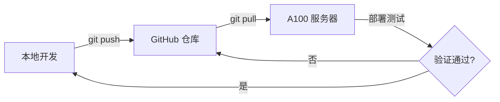

# 开发工作流程规范

## 概述

本项目在三个环境间同步开发：
- **本地开发机** (Windows)
- **A100 服务器** (Linux, SSH: `A100`)
- **GitHub 仓库** (`https://github.com/univesl/writing-assistant.git`)

A100 服务器部署了 `writing-assistant` 的 dev 版本（含文档提取服务等），是本项目的主要运行环境。

## 核心原则

1. **不要直接在服务器上修改代码**。服务器仅用于部署和测试。
2. **所有修改先在本地完成**，测试通过后推送到 GitHub，再从服务器拉取部署。
3. **三地代码保持一致**，避免出现本地能跑、服务器跑不了的情况。

## 标准开发流程



### 步骤详解

1. **同步最新代码**
   ```bash
   # 本地：拉取最新
   git pull github main

   # 服务器：拉取最新
   ssh A100 "cd ~/writing-assistant && git pull github main"
   ```

2. **在本地开发修改**

3. **本地测试**（确保能运行、无报错）

4. **提交并推送**
   ```bash
   git add <files>
   git commit -m "feat: 描述改动内容"
   git push github main
   ```

5. **服务器拉取部署**
   ```bash
   ssh A100 "cd ~/writing-assistant && git pull github main"
   # 如有需要重启服务
   ```

## 紧急修复流程

当服务器上代码需要同步到 GitHub 时：

1. 暂存或提交服务器上的未完成修改
2. 从 GitHub 拉取最新代码
3. 推送服务器本地 commit 到 GitHub

## 分支策略

- **`main`** 分支为唯一稳定分支
- 本地开发直接基于 `main` 进行
- 服务器追踪 `github/main`

## 提交信息规范

```
<type>: <简短描述>

类型: feat / fix / refactor / docs / chore / style / test
示例: feat: 添加文章模板管理功能
      fix: 修复文档导出编码问题
```

## 关于本文件

本文件应随项目推进不断完善，记录开发实践中遇到的问题和解决方案。